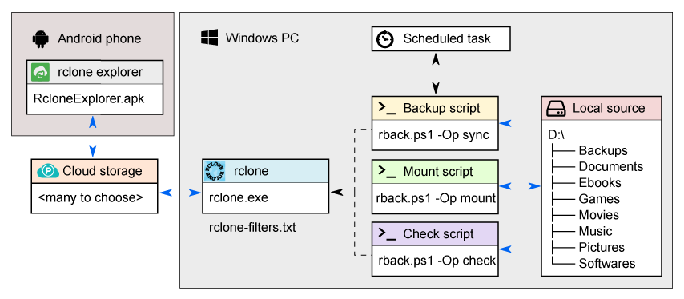

# rclone-backup

## About
A rewrite of [FoxP's rclone batch files](https://github.com/FoxP/rclone-backup) to PowerShell. These scripts run [rclone](https://rclone.org/) on Windows to backup / sync drives to various rclone supported destinations. This new PowerShell version makes use of `.conf` files to allow for runtime changes to config at each invocation.



## Usage
Options:
```powershell
.\rback.ps1 -Config [rback conf file] -Op [about/mount/check/sync] -Password [password] [-Shutdown] [-Hibernate]
```

Example:
```powershell
.\rback.ps1 -Config example.conf -Op sync -Password 12345678 -Hibernate
```

## Conf Files
Edit [configuration variables](https://rclone.org/commands/rclone_sync/) in [`example.conf`](https://github.com/shaunco/rclone-backup/blob/master/example.conf) and **save it as a new file**:
```INI
# ##########################################
# General options
# ##########################################

# Configuration variables
RCLONE_EXE_PATH=rclone.exe
RCLONE_CONFIG_PATH=rclone.conf
RCLONE_LOG_FILE_PATH=rclone-sync-log.txt
# Log level: DEBUG|INFO|NOTICE|ERROR (default NOTICE)
RCLONE_LOG_LEVEL=INFO
# Read filters from file
RCLONE_FILTER_FILE_PATH=rclone-filters.txt
# Number of checkers to run in parallel (default 8)
RCLONE_CHECKERS=8
# Number of file transfers to run in parallel (default 4)
RCLONE_FILE_TRANSFERS=4
# Number of low level retries to do (default 10)
RCLONE_LOW_LEVEL_RETRIES=10
# Retry operations this many times if they fail (default 3)
RCLONE_RETRIES=10
# Interval between retrying operations if they fail, e.g 500ms, 60s, 5m (0 to disable)
RCLONE_RETRIES_SLEEP=5s
# Paths
RCLONE_LOCAL_PATH=D:\
RCLONE_REMOTE_PATH=gdrive-r-crypt:
# Local directory names to sync, comma separated
RCLONE_DIRECTORIES_TO_SYNC=Backups,Documents,Ebooks,Games,Movies,Music,Phone,Pictures,Softwares

# ##########################################
# About-specific options
# ##########################################

# Additional rclone flags
RCLONE_ADDITIONAL_FLAGS_ABOUT=

# ##########################################
# Sync-specific options
# ##########################################

# Additional rclone flags
RCLONE_ADDITIONAL_FLAGS_SYNC=--delete-excluded --progress --stats-one-line

# ##########################################
# Check-specific options
# ##########################################

# Additional rclone flags
RCLONE_ADDITIONAL_FLAGS_CHECK=--delete-excluded

# ##########################################
# Mount-specific options
# ##########################################
# Local drive to mount the volume to, comment out or set to "*" to let rclone pick the next available drive letter
RCLONE_LOCAL_DRIVE=X:
# Optional volume name when mounted 
RCLONE_VOLUME_NAME=pCloudEncrypted
# Buffer size when copying files (default 16M)
RCLONE_BUFFER_SIZE=64M
# IO idle timeout (default 5m0s)
RCLONE_IO_IDLE_TIMEOUT=5s
# Connect timeout (default 1m0s)
RCLONE_CONNECT_TIMEOUT=5s
# Interval between retrying operations if they fail, e.g 500ms, 60s, 5m (0 to disable)
RCLONE_RETRIES_SLEEP_MOUNT=0
# Additional rclone flags
RCLONE_ADDITIONAL_FLAGS_MOUNT=--read-only
```

### 1. Sync local source to remote destination:
Example:
```
D:\                                         gdrive-r-crypt:
├── Backups                                 ├── Backups
├── Documents                               ├── Documents
├── Ebooks                  sync            ├── Ebooks
├── Games                   --->            ├── Games
├── Movies                                  ├── Movies
├── Music                                   ├── Music
├── Pictures                                ├── Pictures
└── Softwares                               └── Softwares
(local source)                              (remote destination)
````
- Copy `rclone.exe` and your `rclone.conf` file to the same directory as `rback.ps1` (or update `mysetup.conf` in the next step to point to them elsewhere)
- Setup your rback conf file, we'll call it `mysetup.conf`

  *(Required options are: `RCLONE_LOCAL_PATH`, `RCLONE_REMOTE_PATH`, `RCLONE_DIRECTORIES_TO_SYNC` see [rclone-sync](https://rclone.org/commands/rclone_sync/) for other options)*
- Edit your [filter file](https://rclone.org/filtering/): `rclone-filters.txt`
- Start `rback.ps1` with the `sync` operation:  
  ```powershell
  .\rback.ps1 -Config mysetup.conf -Op sync -Password 12345678
  ```
- :bulb: Note that you can use the `-Shutdown` or `-Hibernate` argument to shutdown / hibernate after.

### 2. Mount remote as a mountpoint:
Example:
```
X:\                                         gdrive-r-crypt:
├── Backups                                 ├── Backups
├── Documents                               ├── Documents
├── Ebooks                 mount            ├── Ebooks
├── Games                  <~~~~            ├── Games
├── Movies                                  ├── Movies
├── Music                                   ├── Music
├── Pictures                                ├── Pictures
└── Softwares                               └── Softwares
(local source)                              (remote destination)
```

- [WinFsp](http://www.secfs.net/winfsp/) must be installed
- Copy `rclone.exe` and your `rclone.conf` file to the same directory as `rback.ps1` (or update `mysetup.conf` in the next step to point to them elsewhere)
- Setup your rback conf file, we'll call it `mysetup.conf`

  *(Required options are: `RCLONE_LOCAL_DRIVE`, `RCLONE_REMOTE_PATH` see [rclone-mount](https://rclone.org/commands/rclone_mount/) for other options)*
- Start `rback.ps1` with the `mount` operation:  
  ```powershell
  .\rback.ps1 -Config mysetup.conf -Op mount -Password 12345678
- Close console to unmount remote

### 3. Check the integrity of a crypted remote:
Example:
```
D:\                                         gdrive-r-crypt:
├── Backups                                 ├── Backups
├── Documents                               ├── Documents
├── Ebooks                                  ├── Ebooks
├── Games                    MD5            ├── Games
├── Movies                  check           ├── Movies
├── Music                   <--->           ├── Music
├── Pictures                                ├── Pictures
└── Softwares                               └── Softwares
(local source)                              (remote destination)
````
- Copy `rclone.exe` and your `rclone.conf` file to the same directory as `rback.ps1` (or update `mysetup.conf` in the next step to point to them elsewhere)
- Setup your rback conf file, we'll call it `mysetup.conf`

  *(Required options are: `RCLONE_LOCAL_PATH`, `RCLONE_REMOTE_PATH`, `RCLONE_DIRECTORIES_TO_SYNC`, see [rclone-cryptcheck](https://rclone.org/commands/rclone_cryptcheck/) for other options)*
- Edit your [filter file](https://rclone.org/filtering/): `rclone-filters.txt`
- Start `rback.ps1` with the `check` operation:  
  ```powershell
  .\rback.ps1 -Config mysetup.conf -Op check -Password 12345678
  ```
- :bulb: Note that you can use the `-Shutdown` or `-Hibernate` argument to shutdown / hibernate after.
- Wait for rclone cryptcheck to complete
- Search for errors in `rclone-check-log.txt` log file

### 4. Get quota information from the remote:
Example:
```
Total:   500G
Used:    260G
Free:    240G
```
- Copy `rclone.exe` and your `rclone.conf` file to the same directory as `rback.ps1` (or update `mysetup.conf` in the next step to point to them elsewhere)- Setup your rback conf file, we'll call it `mysetup.conf`

  *(Required options are: `RCLONE_REMOTE_PATH`, see [rclone-about](https://rclone.org/commands/rclone_about/) for other options)*
- Start `rback.ps1` with the `about` operation:  
  ```powershell
  .\rback.ps1 -Config mysetup.conf -Op about -Password 12345678
  ```
- Remote quota information is displayed

## Requirements
- [rclone](https://rclone.org/)
- Microsoft Windows
- [Windows File System Proxy](http://www.secfs.net/winfsp/)

## License
rclone-backup is released under the [Unlicense](http://unlicense.org).
